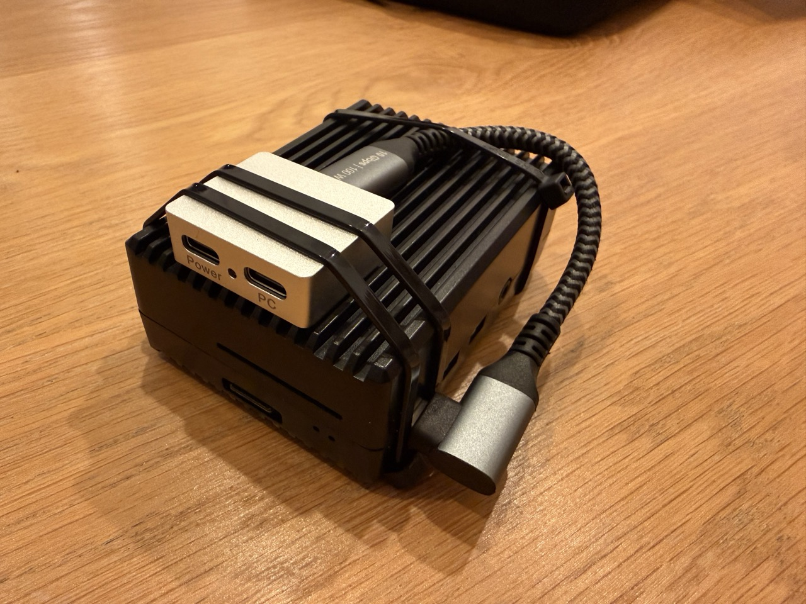

# USB-C as an Ethernet gadget

This is what lets you plug the Pi directly into an iPad/MacBook/Windows
laptop over USB-C and control it as if it were a wired network device —
no Wi-Fi involved at all. Works on Pi models with a USB-C/OTG-capable
port (Pi 4, Pi Zero 2 W, CM4 carrier boards with OTG wired up, etc.).

**`/boot/firmware/config.txt`** (append):
```
dtoverlay=dwc2,dr_mode=peripheral
```

**`/boot/firmware/cmdline.txt`** (add `modules-load=dwc2,g_ether` — must
come *before* `rootwait`):
```
modules-load=dwc2,g_ether
```

**`/etc/network/interfaces.d/usb0`** (new file):
```
allow-hotplug usb0
iface usb0 inet static
  address 192.168.7.2
  netmask 255.255.255.0
```

After a reboot, the Pi enumerates as a USB Ethernet device on the host
computer, reachable at `192.168.7.2`. No DHCP needed — macOS/iPadOS/Windows
will automatically negotiate an address in the same `192.168.7.x` range once
the gadget is detected (some setups may need the host side confirmed/checked
manually the first time, depending on OS).

This coexists fine with Wi-Fi — the Pi can have Wi-Fi *and* the USB-C
gadget link active at the same time, useful if you want internet via
Wi-Fi while controlling the Pi over the direct USB cable.

## Power **and** data over the same USB-C port

This is the part that trips people up: once the port is running in
gadget/peripheral mode for the Ethernet link, a single plain USB-C cable
gives you either power *or* data over that port — not reliably both at
once. The Pi still needs its own proper power supply; it can't count on
drawing enough (or clean/stable) power from whatever it's plugged into
(a tablet's USB port, for instance).

A GPIO/5V-pin power injection hack is possible but risky — no protection
against overvoltage, and a wiring mistake there can fry the board. The
straightforward fix is a dedicated **USB-C power+data splitter/combiner**
— the same category of accessory used in PiKVM-style projects for exactly
this problem: one input for power (your own supply/battery), one input for
data (to the host), a single combined output to the Pi. One known-working
example: [Waveshare Type-C splitter for power and data (USB 2.0, aluminum
housing)](https://www.berrybase.de/en/waveshare-type-c-splitter-fuer-strom-und-daten-usb-2.0-aluminiumgehaeuse-3x-usb-c-pikvm-5v)
— any splitter built for the same "USB gadget + independent power" use
case should work the same way.


